<!-- markdownlint-disable MD033 MD026-->

To demonstrate patching, we'll downgrade `openssh` and `bash` before utilizing the patching application. In the `Terminal`, run the following command.

```bash
dnf -y downgrade bash openssh
```

Next we'll run `insights-client` to update the host's metadata status the Red Hat Hybrid Cloud Console.

```bash
insights-client
```

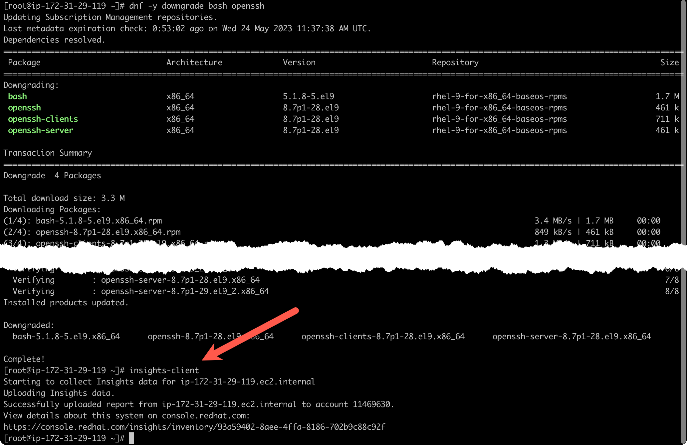
<!-- 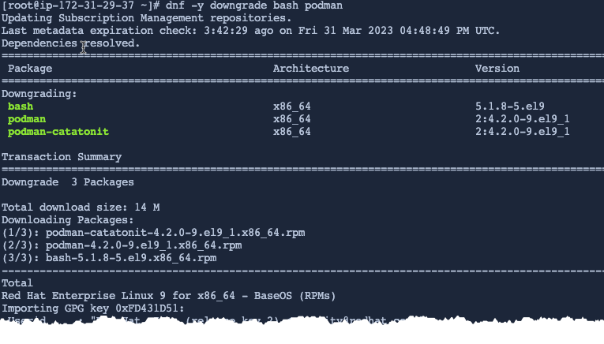
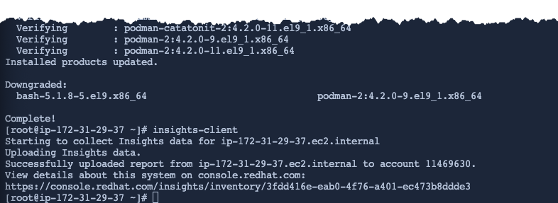 -->

Navigate to the `Systems` menu in the `Patch` application.


Locate your host in the list, based on its private IP address / hostname.  It should have two installable advisories (which are the packages we just downgraded).

1) Select your host.
2) Click `Remediate`.


<!-- Click on the host.


You'll be taken to the menu showing the installable advisories.


We'll upgrade `bash` first.

Click on the `Packages` tab.

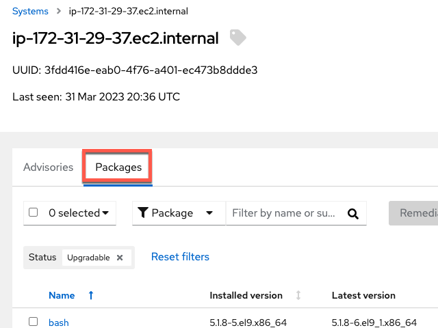

Initiate the remediation by doing the following.

1) Click on the checkbox to select `bash`.
2) Click `Remediate`.

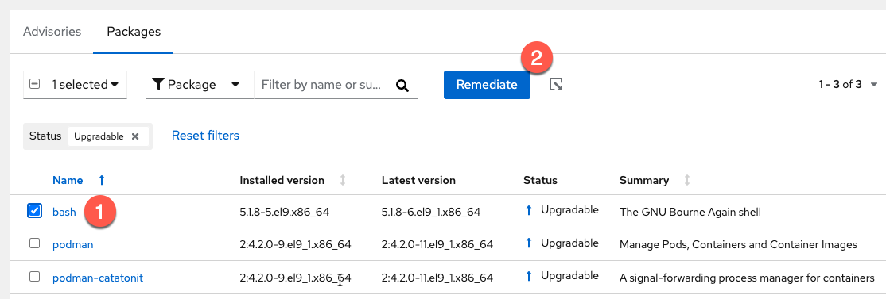 -->

You'll be asked to `Select playbook` next. This feature is designed to enable you to create customized playbooks that include remediations detected from other Insights applications, like `Compliance` for example.

In other words, you may want to upgrade `bash` but then you might also want to remediate other problems detected by OpenSCAP (through the `Compliance` application).

Create a new playbook.

1) Select `Create a new playbook` and give it a name. In this example we'll call it `test-001` (please choose a unique name).
2) Click `Next`.

Review the correct system is selected and click `Next`.

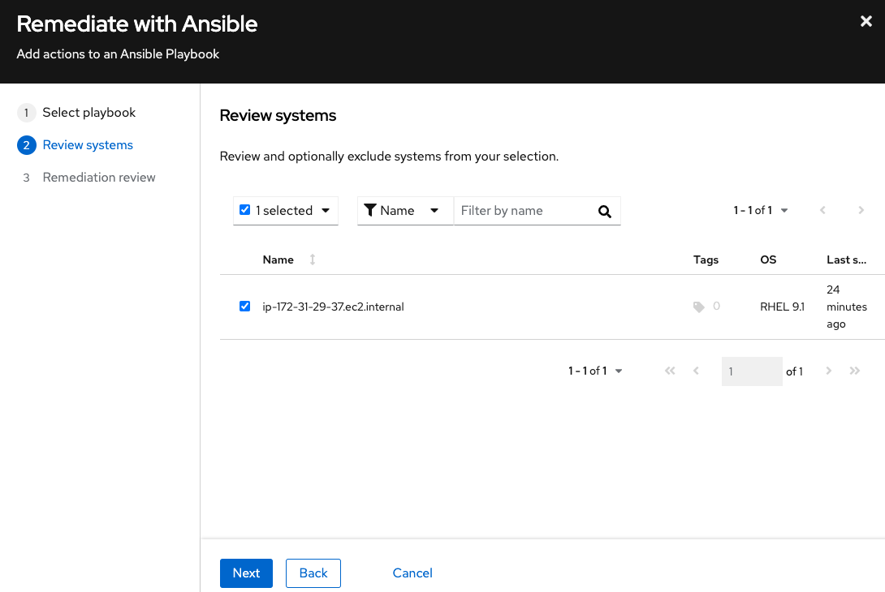

Review the remediation and click `Submit`. Note that `Autoreboot` is enabled. This can be turned off if desired.

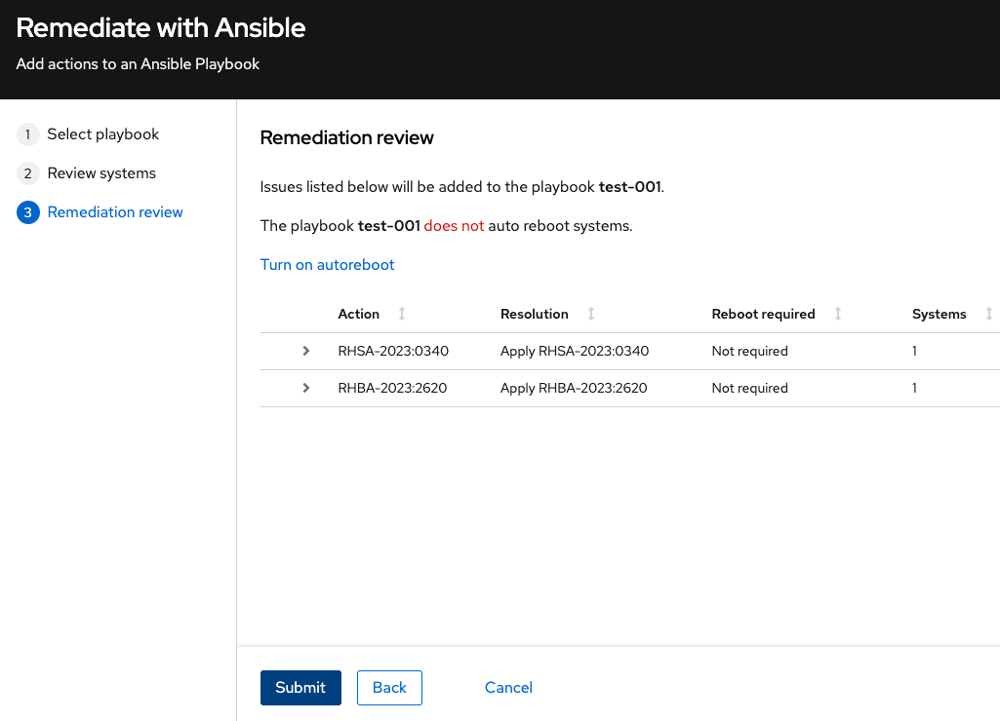

Here's the result. **Do not close this window.**

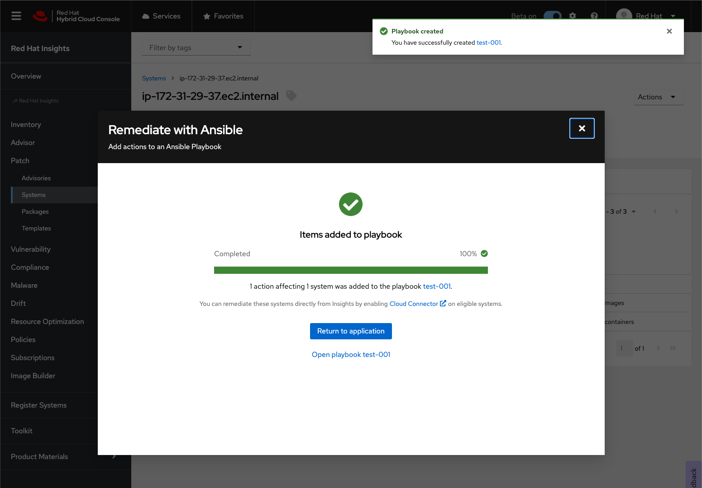

Click on `Open playbook test-001`.

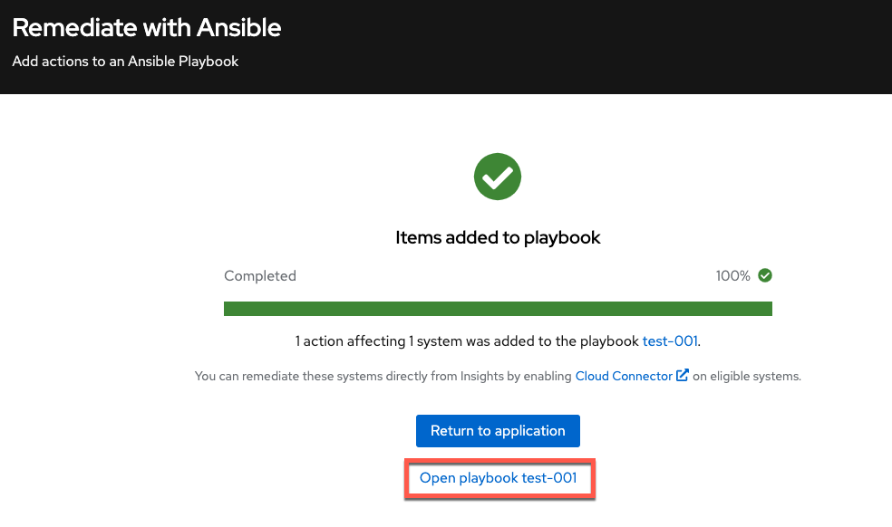

Click on `Execute playbook`


Click on `Execute playbook on 1 system`.

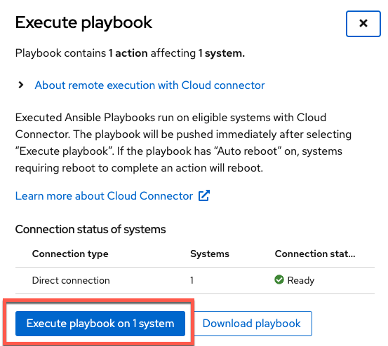

You can view the execution of the remediation playbook in real-time by clicking on `View`.

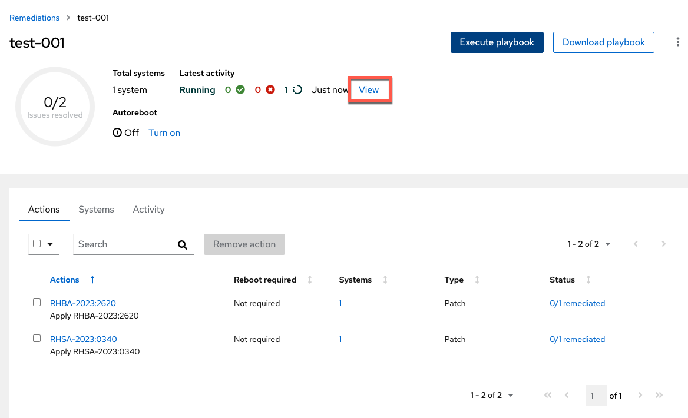

<!-- Click on `Direct connected`.


Click on the `>` symbol next to the name of the host.

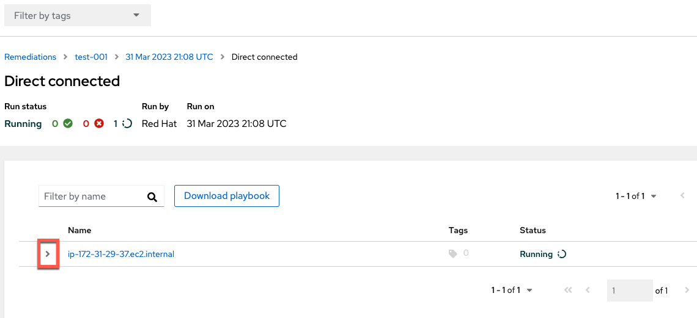
 -->

You can go back to the remediations menu which will show the host issues as resolved.

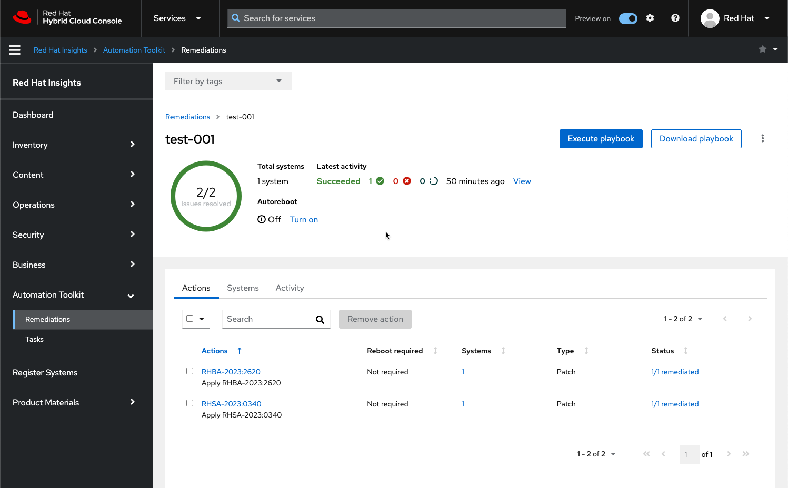
