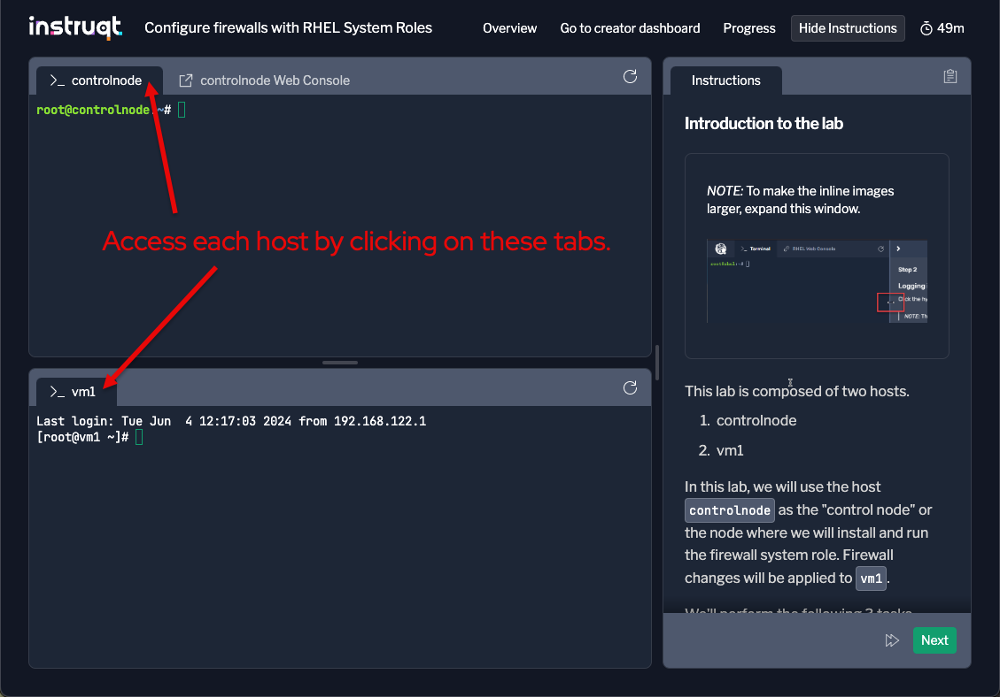

> _NOTE:_ To make the inline images larger, expand this window. 

This lab is composed of two hosts.

1. controlnode
2. vm1

In this lab, we will use the host `controlnode` as the "control node" or the node where we will install and run the firewall system role. Firewall changes will be applied to `vm1`.

We'll perform the following 3 tasks.

1. We will use the firewall system role to open the appropriate port to access web servers on `vm1`. This exercise is to show how to open firewall ports by service.

2. As well, we will also use the firewall system role to open port 9999 on `vm1` to enable inbound tcp connections. This exercise is to show how to open an arbitrary firewall port.

3. Finally, we'll configure port forwarding from 9999 to port 12345 on `vm1`.

You can access each host by clicking on the tabs in the upper left corner of the GUI.

