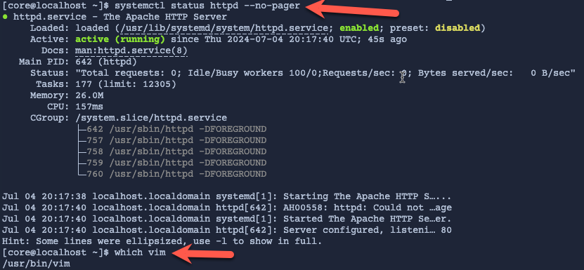

Exploring system status
===

Click on the [button label="VM console" background="#ee0000" color="#c7c7c7"](tab-2) tab.

> [!NOTE]
> You may need to tap `enter` to wake up the console, you should still be logged in as `core`

The `bootc` command is what controls the state of the running host and the available images on disk. This is how we get the current state, if updates are available, change roles, and more. The `bootc status` command is how we explore that state. Let's take a look at relevant parts each of the sections individually with the power of `grep`. Feel free to explore the full output of `bootc status`.

The `spec` section provides the information about the image in use and where `bootc` is looking for it. Our host is pulling from a container registry.
```bash,run
sudo bootc status | grep spec: -A 4
```

The `staged` section provides information about what's been pulled down to disk for the next boot. Since we just did a fresh install, this is null at the moment.
```bash,run
sudo bootc status | grep staged:
```

The `booted` section details the running state, including an image spec (which may differ from the `spec` section in some cases). It has the internal `ostree` version and the SHA256 digest of the image.
```bash,run
sudo bootc status | grep booted: -A 8
```

The `rollback` section details the state `bootc` would revert to if desired. Since we just did a fresh install, this is null at the moment.
```bash,run
sudo bootc status | grep rollback: -A 8
```

Check for and download updates in the VM
===

With the updated image available in the registry, let's see if `bootc` detects it.

```bash,run
sudo bootc upgrade --check
```
> [!NOTE]
> Since we are attached to the console and not a login session, you may see some errors. These are system logs that can be ignored

Since `bootc` tracks the image as listed in the `spec`, we see updates as soon as they hit the registry. We are shown some details about what changes will be made, like the SHA and version. Let's go ahead and stage this update for use.

```bash,run
sudo bootc upgrade
```

Exploring system status
===

Let's see what happened on disk.

The `staged` section has the same fields now as `booted`, but with the details of the new image. This has been prepared by `bootc upgrade` and is ready to be activated on the next boot.
```bash,run
sudo bootc status | grep staged: -A 8
```

Testing persistence in /etc
===

When applying updates, bootc will pull any changes in `/usr` from the new image, letting us install new software. Any local changes to `/etc` will be merged with what's in the image, with local changes winning. Nothing in the bootc image `/var` structure will be applied, as this is considered machine state.

Let's test this by changing our user password to `1redhat`
```bash,run
echo 'core:1redhat' | sudo chpasswd
```

Once staged, the new image will take effect on the next reboot. If we needed to wait for a maintenance window we could stage changes immediately, then schedule the reboot. Let's go ahead and restart the system now to get our changes.

```bash,run
sudo reboot
```
Once the system has completed rebooting, you can log in with the new credentials. Since this user's credentials are stored in `/etc`, the new password will be in effect.

Username:

```bash,run
core
```

Password:

```bash,run
1redhat
```

Now let's make sure Apache is still running and we have `vim` installed.

```bash,run
systemctl status httpd --no-pager
```

```bash,run
which vim
```

Here's what you should see as output.



You've now created a new image mode system from a Containerfile and seen how to manage updates for the system. This should provide a good basis to explore image mode for RHEL with your own standard builds and applications. In later labs, we'll explore some of the other available life cycle options like `rollback` and `switch`.