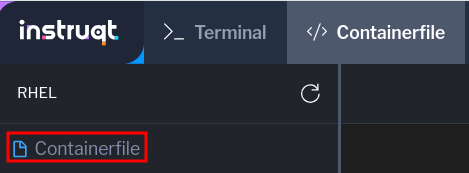

A word about tags
===

To this point, we've been letting podman automatically create tags for the images we've built. As a review, the naming convention for container images is `registry/name:tag`. We've been setting the registry and name in the command line, which means all of the tags are set to `latest` by default.

While this is convenient, it can create a lot of confusion. Which `latest` was really created last? What in that container? Which updates did we provide? Have you seen the `latest` tag in any of the `bootc status` output so far?


Using tags for identifying image contents
===

Let's add some new content to our webserver in prepartion for deploying an application, then build it using a new tag.

Click on the [button label="Containerfile" background="#ee0000" color="#c7c7c7"](tab-1) tab.

If not already shown, select Containerfile in the list on the right side of the tab.




Add the following line at the end of the file:

````
RUN echo "New application coming soon!" > /var/www/html/index.html
````


The editor will automatically save changes. Once you see Changes Saved in the upper right, you can return to the [button label="Terminal" background="#ee0000" color="#c7c7c7"](tab-0) tab.

Use podman to build the image.
===
With our changes in the Containerfile saved, we will run `podman build` to get a new image. But this time we'll set a specific tag by adding `v2` to the end of the container name.

```bash,run
podman build -t [[ Instruqt-Var key="CONTAINER_REGISTRY_ENDPOINT" hostname="rhel" ]]/test-bootc:v2 .
```

Push multiple tagged versions to the registry
===

Once the updated image has been built, we can push it to the registry. Once again, note how only the changed layers need to be added to the registry even though we created a new tag.

```bash,run
podman push [[ Instruqt-Var key="CONTAINER_REGISTRY_ENDPOINT" hostname="rhel" ]]/test-bootc:v2
```
Tags communicate information to people, not the container tools. The tools will use the IDs associated to tag when doing operations. This means we can use tags to carry different kinds of information for users.

Let's say we also wanted to let people know this image was for the development environment and not for production use. We could add a `dev` tag to our new image with the `podman image tag` subcommand. This tag is only applied locally, so we need push that to the registry as well.
```bash,run
podman image tag [[ Instruqt-Var key="CONTAINER_REGISTRY_ENDPOINT" hostname="rhel" ]]/test-bootc:v2 [[ Instruqt-Var key="CONTAINER_REGISTRY_ENDPOINT" hostname="rhel" ]]/test-bootc:dev
```
```bash,run
podman push [[ Instruqt-Var key="CONTAINER_REGISTRY_ENDPOINT" hostname="rhel" ]]/test-bootc:dev
```

Let's take a look at the different images created.
```bash,run
podman images test-bootc
```
You can see we have 3 images listed, but a closer look at the `IMAGE ID` column shows that 2 of them are the same.

With more sophiscated tools than available in this environment, the flexibility afforded by tags can be very powerful.

Switch to the v2 image
===

Click on the [button label="VM console" background="#ee0000" color="#c7c7c7"](tab-2) tab.

> [!NOTE]
> You may need to tap `enter` to wake up the console, you should still be logged in as `core`


The new image didn't use the `latest` tag, it won't be seen as an update by `bootc`. Notice there's nothing after the name `test-bootc` in the output.

```bash,run
sudo bootc upgrade --check
```

Since tagging the image makes this a new image, we can use `bootc switch` to install it like we did in the first exercise to change repositories. And since there are two tags available, you can use either `v2` or `dev` to install the same image.
```bash,run
sudo bootc switch [[ Instruqt-Var key="CONTAINER_REGISTRY_ENDPOINT" hostname="rhel" ]]/test-bootc:v2
```
Using `bootc switch` we can use any of the image three identifiers (registry, name, and tag) to handle a variety of different scenarios.

We need to restart the system to get our changes.

```bash,run
sudo reboot
```

Check the VM is running the v2 image
===

Once the system has completed rebooting, you can log back in.

Username:

```bash,run
core
```

Password:

```bash,run
redhat
```

Let's check what the `spec` section of `bootc status` now says about where we're looking for updates.
```bash,run
sudo bootc status | grep spec: -A 4
```

What about our new placeholder index page?

```bash,run
curl localhost
```

```bash,run
ls -alh /var/www/html/index.html
```

The new index doesn’t appear, and it’s also not on disk. Yes, there's a deliberate error in the instructions. This is expected based on how bootc handles directories and image contents during changes.

Stay logged into the VM to explore this in the next exercise.
