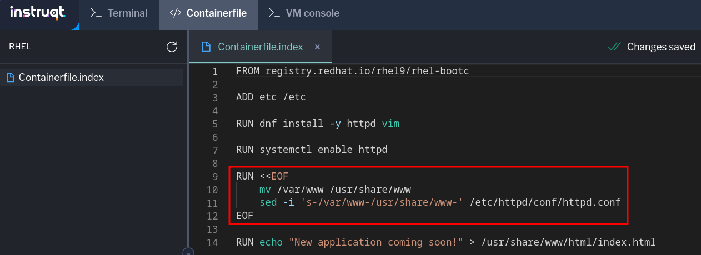

Did the build fail?
===

You can return to the [button label="Terminal" background="#ee0000" color="#c7c7c7"](tab-0) tab to explore what happened to the new index.html file

Did the new index get created when we built the image?

We can check by running the image as a container and inspecting the directory. Another benefit to using standard container tools is new ways to iterate and inspect images without needing to install them.

```bash,run
podman run --rm [[ Instruqt-Var key="CONTAINER_REGISTRY_ENDPOINT" hostname="rhel" ]]/test-bootc:v2 ls /var/www/html
```
Image vs host state
===

The file is there, so why didn't it show up on the host? In the image mode basics lab, we discussed how `/etc` is treated in image mode. The `/var` hierarchy is also treated specially.

|directory|owner|bootc action|
|---|---|---|
|/usr|image|overwrite|
|/etc|host|merge|
|/var|host|ignore|

The `/var` directory is considered by `bootc` to be controlled by the host as local state. If we want to manage web content at build time and version it with the image, we'll need to move it somewhere `bootc` will control.

Versioning files with the image
===

Let's look at a new Containerfile to see how we can do that.

Click on the [button label="Containerfile" background="#ee0000" color="#c7c7c7"](tab-1) tab.

Select Containerfile.index from the list on the right side of the tab.


Look at the new `RUN` command that uses the `heredoc` format to wrap several lines.



This block will move the default directory and files installed by Apache to a new directory under `/var`. The second line will update the htttpd config file to change the default document root to our new directory.

Note that since we haven't made any local changes to this file in `/etc` on the host, this change will show up on the host. If you had made local changes to the config, you may need to to create a drop-in file or use some other means to update the Apache config.

Once you feel you understand the change, you can return to the [button label="Terminal" background="#ee0000" color="#c7c7c7"](tab-0) tab

Use podman to build the image.
===
We can pass this new file to the `podman build` command and this time with a `v3` tag. Using this sort of semantics can help folks understand what's current.

```bash,run
podman build -t [[ Instruqt-Var key="CONTAINER_REGISTRY_ENDPOINT" hostname="rhel" ]]/test-bootc:v3 -f Containerfile.index
```

Once the updated image has been built, we can push it to the registry. Once again, note how only the changed layers need to be added to the registry even though we created a new tag.

```bash,run
podman push [[ Instruqt-Var key="CONTAINER_REGISTRY_ENDPOINT" hostname="rhel" ]]/test-bootc:v3
```

Let's inspect the new image for our new file location
```bash,run
podman run --rm [[ Instruqt-Var key="CONTAINER_REGISTRY_ENDPOINT" hostname="rhel" ]]/test-bootc:v3 ls /usr/share/www/html
```

Switch the VM to our newest version
===
To update the VM, return to the the VM Console by clicking on the [button label="VM console" background="#ee0000" color="#c7c7c7"](tab-2) tab.

> [!NOTE]
> If the console hasn't connected or there is an error, you can reconnect by clicking Refresh next to the tab name. The prompt will look like this.  If you are already logged in, you may not have rebooted after the rollback.

Log in with the following credentials:

Username:

```bash,run
core
```

Password:

```bash,run
redhat
```

Just like in the other exercises, we can use `bootc switch` to change to the image we just created with the updated Apache config.
```bash,run
sudo bootc switch [[ Instruqt-Var key="CONTAINER_REGISTRY_ENDPOINT" hostname="rhel" ]]/test-bootc:v3
```
Check that the new image has been staged for the next boot.
```bash,run
sudo bootc status | grep staged: -A 8
```

You can also check the boot order in the spec block to see what has been sent to the bootloader. Notice it's back to `default`.
```bash,run
sudo bootc status | grep Order
```

Let's go ahead and restart the system one last time to get our changes.
```bash,run
sudo reboot
```

Once the system has completed rebooting, you can log back in.
Username:

```bash,run
core
```

Password:

```bash,run
redhat
```
What about our new placeholder index page?

```bash,run
curl localhost
```

We have a new docroot that is controlled from the image. We can use this idea with any software or other content we want to ensure is part of our standard build rather than managed at runtime on a host.

You've now explored how to change the image that a host is tracking, gained some insights into the differences between directory states, and been able to roll back from an image update. This should provide a good basis to explore image mode further on your own!
