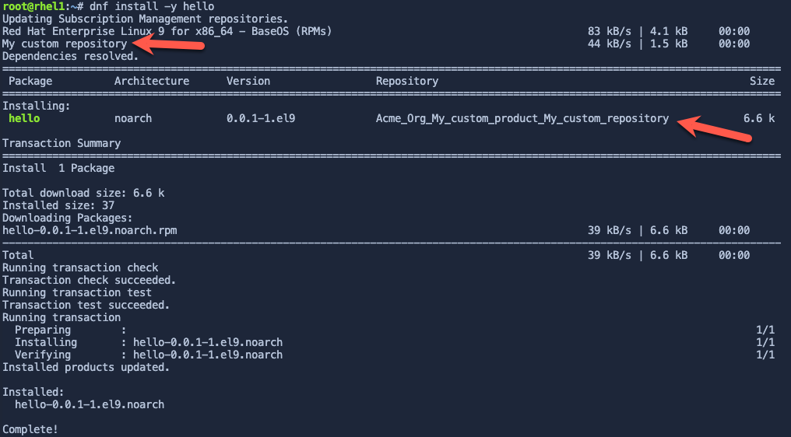
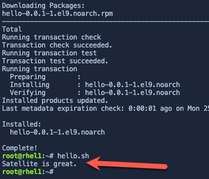

In this assignment we'll upload software into a custom repository in Satellite. This process involves creating the following:
1) Create a product.
2) Add a yum repository.
3) Upload software to the repository.

A yum package called `hello-0.0.1-1.el9.noarch.rpm` has been downloaded to `/root/` in `satellite.lab`. We will upload this single package to the new repository.

Create a custom product, repository, and upload a file
======================================================

Copy and paste the following playbook into the `Satellite Server` terminal.

```
tee ~/customrepo.yml << EOF
---
- name: Create a custom product, a custom repository, and upload an RPM.
  hosts: localhost
  remote_user: root

  tasks:
  - name: "Create a custom product."
    redhat.satellite.product:
      username: "admin"
      password: "bc31c9a6-9ff0-11ec-9587-00155d1b0702"
      server_url: "https://satellite.lab"
      name: "My custom product"
      organization: "Acme Org"
      state: present

  - name: "Create a custom repository"
    redhat.satellite.repository:
      username: "admin"
      password: "bc31c9a6-9ff0-11ec-9587-00155d1b0702"
      server_url: "https://satellite.lab"
      name: "My custom repository"
      state: present
      content_type: "yum"
      product: "My custom product"
      organization: "Acme Org"

  - name: "Upload a file"
    redhat.satellite.content_upload:
      username: "admin"
      password: "bc31c9a6-9ff0-11ec-9587-00155d1b0702"
      server_url: "https://satellite.lab"
      src: "hello-0.0.1-1.el9.noarch.rpm"
      repository: "My custom repository"
      product: "My custom product"
      organization: "Acme Org"
EOF
```

This playbook dows the following:
1) Create a product called `My custom product`.

2) Create a repository called `My custom repository`.

3) Upload a file from `/root/hello-0.0.1-1.el9.noarch.rpm` to `My custom repository`.

```
ansible-playbook customrepo.yml
```

Update the RHEL9 content view and publish and promote it
==========================================================

In order to make the `hello` rpm available to `rhel`, we must add the repo to the `RHEL9` content view. You may recall in the previous assignment, we had to create the `RHEL9` content view, containing the RHEL9 BaseOS repo and publish it. Then we had to promote the `RHEL9` content view to the `Capsule Production` lifecycle environment. Finally we manually synchronized the `Capsule Production` lifecycle environment to `capsule.lab`.

To replicate the custom repository we just created in this assignment, we'll need to update the `RHEL9` content view to add `My custom repository` and publish it. Then we'll promote the new version of the `RHEL9` content view to the `Capsule Production` lifecycle environment which will automatically synchronize to `capsule.lab`.

Copy and paste the following playbook to the `Satellite Server` terminal.

```
tee ~/customrepopublishpromote.yml << EOF
---
- name: Publish and promote a new version of the RHEL9 content view.
  hosts: localhost
  remote_user: root

  tasks:
  - name: "Update RHEL9 content view"
    redhat.satellite.content_view:
      username: "admin"
      password: "bc31c9a6-9ff0-11ec-9587-00155d1b0702"
      server_url: "https://satellite.lab"
      organization: "Acme Org"
      name: "RHEL9"
      repositories:
        - name: 'Red Hat Enterprise Linux 9 for x86_64 - BaseOS RPMs 9'
          product: 'Red Hat Enterprise Linux for x86_64'
        - name: 'My custom repository'
          product: 'My custom product'

  - name: "Publish a content view and promote that version to Capsule Production LCE, not idempotent"
    redhat.satellite.content_view_version:
      password: "bc31c9a6-9ff0-11ec-9587-00155d1b0702"
      server_url: "https://satellite.lab"
      organization: "Acme Org"
      username: "admin"
      content_view: "RHEL9"
      lifecycle_environments:
        - "Capsule Production"
EOF
```

Run the playbook.

```
ansible-playbook customrepopublishpromote.yml
```

Publishing and promoting a new version of the RHEL9 content view will trigger a capsule sync operation, synchronizing the `Capsule Product` lifecycle environment.

Enable "My custom repository"
=============================

View the repositories available to `rhel1`. In the `rhel1` terminal, enter the following.

```
subscription-manager repos
```
Here's the output.


In the `rhel1` terminal, run the following command to enable `My custom repository`.

```
subscription-manager repos --enable Acme_Org_My_custom_product_My_custom_repository
```

Install the rpm on rhel1
========================

In the `rhel1` terminal run the following command.

```
dnf install -y hello
```


Test the installation by running the following command in the `rhel1` terminal.

```
hello.sh
```

