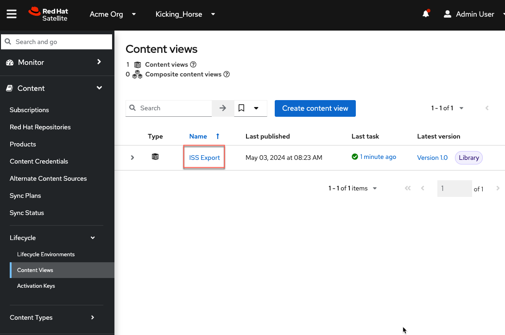
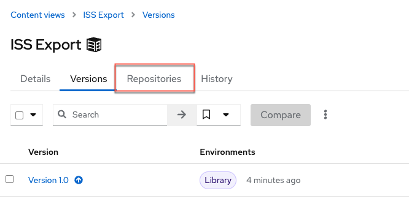
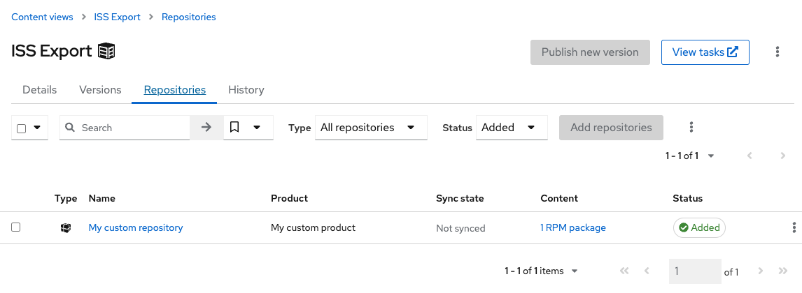

Inter-Satellite Sync (ISS) export sync exports software at the repository, content view, and lifecycle environment levels. In this assignment, we'll export the custom repo 'My custom repository' at the content view level from `satellite.lab` and import it into `satellite-2.lab`.

Create a new content view
===

In order to save time, we'll create a new content view with a minimal amount of software.

Copy and paste the following playbook into the [button label="Satellite Server"](tab-0) terminal.

```bash,run
tee ~/createandpublishissexport.yml << EOF
---
- name: Create a new CV "ISS Export".
  hosts: localhost
  remote_user: root

  tasks:
  - name: "Create ISS Export content view"
    redhat.satellite.content_view:
      username: "admin"
      password: "bc31c9a6-9ff0-11ec-9587-00155d1b0702"
      server_url: "https://satellite.lab"
      name: "ISS Export"
      organization: "Acme Org"
      repositories:
        - name: 'My custom repository'
          product: 'My custom product'

  - name: "Publish and promote ISS Export to Library lifecycle environment"
    redhat.satellite.content_view_version:
      username: "admin"
      password: "bc31c9a6-9ff0-11ec-9587-00155d1b0702"
      server_url: "https://satellite.lab"
      organization: "Acme Org"
      content_view: "ISS Export"
      lifecycle_environments:
        - "Library"
EOF
```

This playbook creates a new content view called `ISS export` containing the repository `My custom repository`. Then the playbook publishes and promotes the content view `ISS Export` to the `Library` lifecycle environment.

Run the `createandpublishissexport.yml` playbook in the [button label="Satellite Server"](tab-0) terminal.

```bash,run
ansible-playbook createandpublishissexport.yml
```

Create an Inter-Satellite Sync export
===

Now we'll export the content view `ISS Export` as an ISS export.

Copy and paste the following command into the [button label="Satellite Server"](tab-0) terminal.

```bash,run
hammer content-export complete version --content-view "ISS Export" --version "1.0" --organization "Acme Org"
```

Copy the exported data to satellite-2.lab
===

On the [button label="Satellite Server"](tab-0), you can find the exported data in `/var/lib/pulp/exports/Acme_Org/Default_Organization_View/1.0/`.

```bash,run
ls /var/lib/pulp/exports/Acme_Org/ISS_Export/1.0/*/
```


In the[button label="Satellite Server"](tab-0) terminal run the following command.

```bash,run
scp -o "StrictHostKeyChecking no" -rp /var/lib/pulp/exports/Acme_Org/ISS_Export/1.0/*/ satellite-2.lab:/var/lib/pulp/imports/Acme_Org/
```


This command will create a new directory on `satellite-2.lab` in `/var/lib/pulp/imports` called `Acme_Org` and copy all the exported data to it.

Import the exported data into satellite-2.lab
===

We need to change the ownership of the data we just exported to the `pulp` account and group. Switch to the [button label="Satellite Server 2"](tab-2) terminal and enter the following command.

```bash,run
chown -R pulp:pulp /var/lib/pulp/imports/Acme_Org/
```

In the [button label="Satellite Server 2"](tab-2) terminal, run the following command.

```bash,run
hammer content-import version --organization "Acme Org" --path "/var/lib/pulp/imports/Acme_Org"
```

You can verify the result in the web gui with the same credentials as `satellite.lab`. Click on the `Satellite 2 Web UI`.

Username

```
admin
```

Password

```
bc31c9a6-9ff0-11ec-9587-00155d1b0702
```

>[!IMPORTANT]
>Ensure that you are in `Acme Org` organization and the `Kicking Horse` location.
>

Click on `ISS Export`.



In the `ISS Export` menu, click on `Repositories`.



In this menu you can see that we have successfully imported the repository `My custom repository`.


