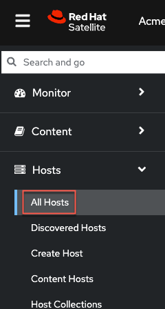
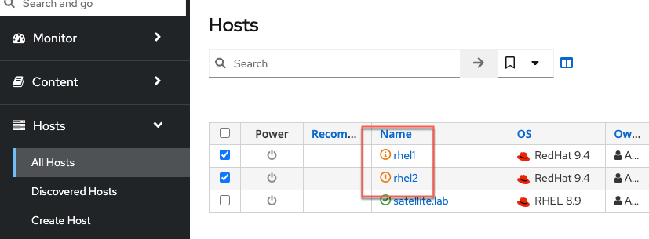

<!-- markdownlint-disable MD033 -->

Red Hat Product Errata are advisories on bug fixes, security, and enhancement on software installed on your RHEL host, based on analysis by Red Hat engineers. Red Hat Satellite provides a simple method for applying these fixes to hosts. We'll walk through those steps.

For more information on Red Hat Errata, [please visit this page](https://access.redhat.com/articles/2130961).

Apply errata
============

To view Errata in Satellite, click on `Content`, `Content Types`, and `Errata`.

You'll be taken to a page containing all the Errata contained in the repositories we originally synchronized in the second challenge of this lab.

Not all of these Errata apply to the hosts we've added to this Satellite server. To view applicable and installable Errata, click on the `Installable` radio boxes.

Let's install all the Installable Errata to our two hosts.

Select all of the Errata we just filtered.

>[!NOTE]
>Increase the page size to select all the errata. If the number of errata exceed the maximum page size, you'll have to run this operation multiple times or run it from the host > content > errata menu. For the purposes of this lab, it's not necessary to apply all errata.

You'll be taken to the Apply Errata menu where you should do the following:

1) Select the hosts to apply the Errata. In this case we'll select all hosts.

2) Click `Next`.

Click confirm to apply the errata.

To view the application of Errata in real-time, click on the host `rhel1`.

On the following page, you'll be able to see the application process.

To return to the job status page, click `Back to Job`.

When the job is complete, the page will look like this.

Go to Hosts > All Hosts.

All hosts managed by Satellite will still display in an orange font signifying there are status warnings. This is because the Tracer application has detected services that require restarting. If the kernel or systemd has been updated, the hosts will require a reboot.

Resolve Traces (Restart services that require it)
=================================================
When software is updated on a host, software that runs as a service require a restart before the updated software is loaded into memory. Tracer will detect which of these services need to be restarted.

Click on a host (it doesn't matter which, you'll have to perform this procedure twice.)

Do the following to resolve the traces.

1) Click on the `Traces` tab. All the services that require restarting are listed here. If no services require restart, this list would be blank.

2) Select all the services listed.

3) Click `Restart app`.

>[!NOTE]
>Resolving traces might take a few minutes, especially for a reboot, since the host will wait 60 seconds before initiating the reboot.

When you view the `Traces` menu, the list will be empty signifying no services require restart.

Repeat the procedure to resolve Traces with the remaining host.
